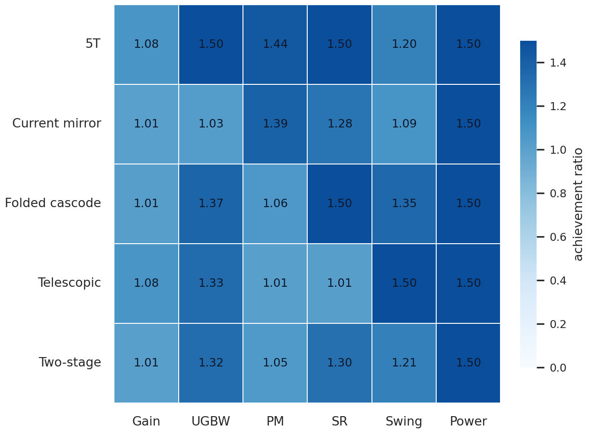
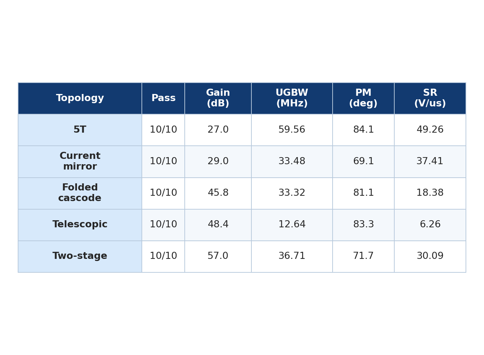
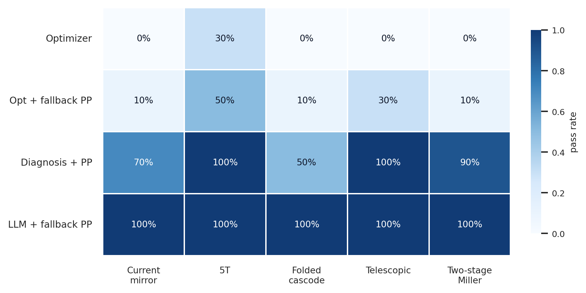
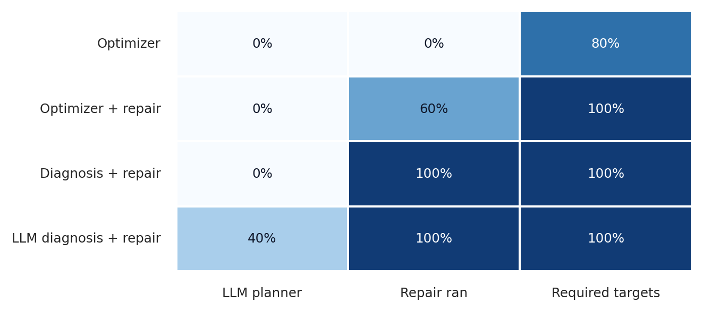
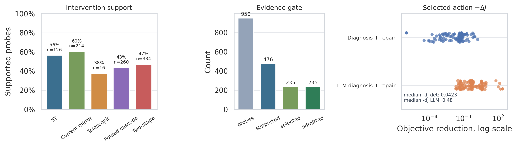
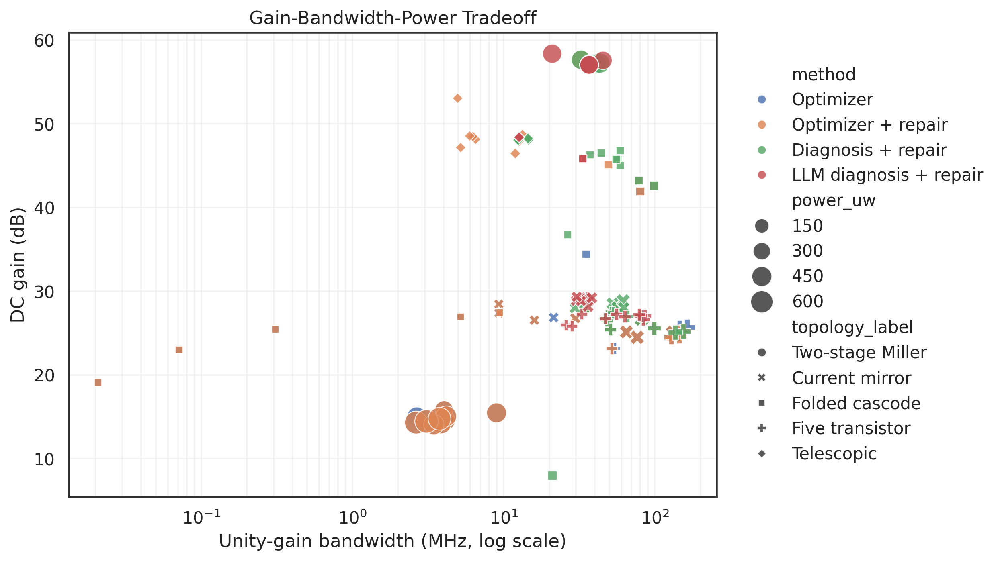
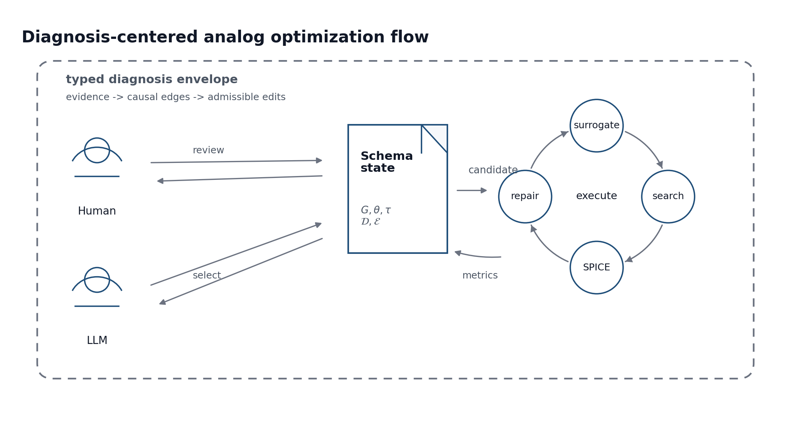
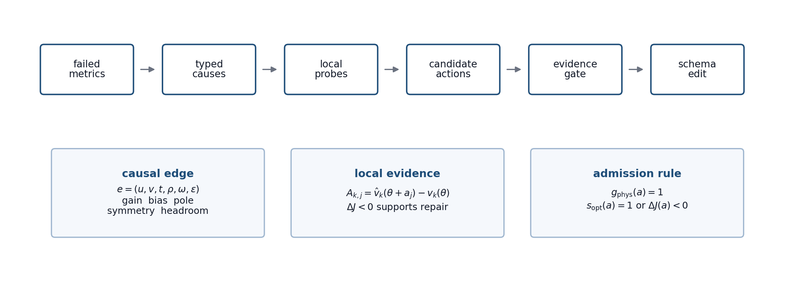

# AnalogRF-IR

[](#installation)
[](#installation)
[](LICENSE)

AnalogRF-IR is a simulator-backed analog circuit optimization framework for
topology-aware OTA sizing. It combines a typed YAML design schema, $G_m/I_D$-guided
surrogate search, NSGA-II exploration, ngspice validation, causal diagnosis,
LLM-guided diagnosis, and evidence-gated action application.

The central contract is that humans, deterministic diagnosis, optimizer logic,
and optional LLM planning all operate through the same typed schema. A proposed
edit is executable only when it is physically valid and supported by
optimizer-side or local SPICE evidence.

> Status: manuscript and release package in preparation. The repository is
> distributed under the MIT License. See [LICENSE](LICENSE).

## Key Features

- Typed YAML schemas for topology, device roles, variables, constraints,
  targets, evaluations, process setup, and compact diagnostics.
- ASIR semantic extraction for roles, symmetry groups, gain stages, bias paths,
  compensation networks, and typed dependencies.
- $G_m/I_D$-guided surrogate sizing with bounded NSGA-II exploration.
- ngspice validation for AC gain, UGBW, phase margin, transient slew rate,
  output swing, power, operating point, and headroom.
- Causal diagnosis over failed metrics, topology roles, bias paths, pole/gain
  dependencies, and simulator evidence.
- Local SPICE intervention models for action-to-violation estimates.
- Evidence-gated schema actions with symmetry copying, physical checks, and
  explicit apply/skip records.
- Optional DeepSeek-compatible LLM planning as a diagnosis and selection layer,
  not as unrestricted edit authority.

## Results At A Glance

The maintained IHP SG13G2 OTA regressions use high-impedance
`C_L ~= 1 pF` targets. They are schematic-level TT ngspice experiments, not
pad, cable, low-resistance, extracted-layout, or 50 ohm load signoff.

| Topology | Gain | UGBW | PM | SR | Swing | Power |
| --- | ---: | ---: | ---: | ---: | ---: | ---: |
| 5T OTA | 25 dB | 25 MHz | 60 deg | 15 V/us | 0.65 V | 200 uW |
| Current-mirror OTA | 28 dB | 30 MHz | 60 deg | 25 V/us | 0.60 V | 300 uW |
| Folded-cascode OTA | 45 dB | 20 MHz | 60 deg | 12 V/us | 0.60 V | 600 uW |
| Telescopic OTA | 48 dB | 7 MHz | 60 deg | 6 V/us | 0.55 V | 300 uW |
| Two-stage Miller OTA | 57 dB | 20 MHz | 60 deg | 10 V/us | 0.49 V | 1000 uW |

Ten-seed ngspice runs pass the priority 1-2 targets for all five maintained OTA
topologies under the LLM-guided diagnosis and repair flow:

| Topology | Status | Iter | Gain | UGBW | PM | SR | Swing | Power |
| --- | --- | ---: | ---: | ---: | ---: | ---: | ---: | ---: |
| 5T OTA | 10/10 | 3 | 27.0 dB | 59.56 MHz | 84.1 deg | 49.26 V/us | 0.860 V | 61.8 uW |
| Current-mirror OTA | 10/10 | 3 | 29.0 dB | 33.48 MHz | 69.1 deg | 37.41 V/us | 0.845 V | 53.4 uW |
| Folded-cascode OTA | 10/10 | 1 | 45.8 dB | 33.32 MHz | 81.1 deg | 18.38 V/us | 0.959 V | 20.7 uW |
| Telescopic OTA | 10/10 | 1 | 48.4 dB | 12.64 MHz | 83.3 deg | 6.26 V/us | 0.958 V | 16.5 uW |
| Two-stage Miller OTA | 10/10 | 3 | 57.0 dB | 36.71 MHz | 71.7 deg | 30.09 V/us | 0.787 V | 372.4 uW |

The current ablation matrix compares five OTA topologies, ten seeds, and four
method variants. The rows are re-scored with the same priority 1-2 target
definition. The reported `ngspice_success` field denotes required-target
validation success; raw per-analysis simulator warnings remain available in
`pass_status` and are not used as the top-level pass/fail criterion:

| Method | 5T | Current mirror | Folded cascode | Telescopic | Two-stage | Total |
| --- | ---: | ---: | ---: | ---: | ---: | ---: |
| Optimizer | 3/10 | 0/10 | 0/10 | 0/10 | 0/10 | 3/50 |
| Optimizer + repair | 5/10 | 1/10 | 1/10 | 3/10 | 1/10 | 11/50 |
| Diagnosis + repair | 10/10 | 7/10 | 5/10 | 10/10 | 9/10 | 41/50 |
| LLM diagnosis + repair | 10/10 | 10/10 | 10/10 | 10/10 | 10/10 | 50/50 |

The published project figures are regenerated from a unified 200-cell manifest
that combines the 150 non-LLM control cells and the 50 LLM full-flow cells.
The extracted data tables are written under `docs/assets/`.

| Target achievement | Measured metrics |
| --- | --- |
|  |  |

| Ablation pass rate | Method traceability |
| --- | --- |
|  |  |

| Diagnosis validation | Gain-bandwidth-power distribution |
| --- | --- |
|  |  |

## Method Summary

The flow uses a typed schema as the executable interface between human review,
surrogate search, ngspice validation, causal diagnosis, optional LLM planning,
and postprocess repair.



Failed metrics are mapped to typed causes, tested through local SPICE probes,
converted into candidate schema actions, and filtered by an evidence gate.
Unsupported LLM edits are recorded as skipped notes rather than executable
changes.



The diagnosis validation figure reports the full artifact funnel: local probes,
supported probes that reduce a failed target, and selected/admitted actions.
Selected-action improvement is shown as objective reduction `-Delta J` on a log
scale, so small deterministic repairs and larger LLM residual-escape repairs
remain comparable without saturating the plot.

For normalized violation vector `v`, local action response column `A_j`, and
weights `w_i`, the specification objective is:

```text
Phi(v) = sum_i w_i v_i^2
J_spec(s) = Phi(v(s))
```

An action is admissible only if it passes the physical gate and is either part
of the constrained optimizer's compatible action set or independently reduces
the action objective with trusted local SPICE evidence. Guarded actions also
require local evidence:

```text
admissible(a, s) :=
  physical_gate(s, a)
  and (
    optimizer selects a
    or trusted local SPICE evidence decreases J_act
  )
  and (not guarded(a) or local evidence gate passes)
```

## Installation

Requirements:

- Ubuntu Linux or WSL Ubuntu
- Python 3.10+
- `ngspice`
- Python packages in `requirements.txt`
- IHP SG13G2 model files referenced by `environment_ihp_sg13g2.yaml`

```bash
sudo apt-get update
sudo apt-get install -y python3 python3-venv python3-pip ngspice

cd /path/to/AnalogRF-IR
python3 -m venv .venv
. .venv/bin/activate
python3 -m pip install --upgrade pip
python3 -m pip install -r requirements.txt
```

## Quick Start

Run one IHP SG13G2 130 nm OTA optimization:

```bash
python main.py \
  --env environment_ihp_sg13g2.yaml \
  --schema inputs/ota/folded_cascode/folded_cascode_ota_ihp130.yaml \
  --topology yaml \
  --generations 30 \
  --pop-size 80 \
  --seed 10
```

Run the LLM-guided diagnosis flow with a local, gitignored config:

```bash
mkdir -p ~/.config/analogrf-ir
printf '%s\n' 'YOUR_DEEPSEEK_KEY' > ~/.config/analogrf-ir/deepseek.key
cp configs/local/llm.example.yaml configs/local/llm.yaml
```

```bash
python main.py \
  --config configs/local/llm.yaml \
  --env environment_ihp_sg13g2.yaml \
  --schema inputs/ota/two_stage_miller/two_stage_miller_ota.yaml \
  --topology yaml \
  --agent-rounds 30 \
  --postprocess-policy fallback \
  --seed 10
```

If no LLM key is configured, the flow records LLM-disabled status and keeps
deterministic artifacts usable for tests and non-LLM experiments.

## Reproducibility

Run tests:

```bash
python -m pytest -q
```

Dry-run the controlled ablation matrix:

```bash
python scripts/run_ablation.py --config configs/ablation_ihp130_ota.yaml
```

Run the matrix and keep going after individual failures:

```bash
python scripts/run_ablation.py \
  --config configs/ablation_ihp130_ota.yaml \
  --local-config configs/local/llm.yaml \
  --run --keep-going
```

Regenerate README figures from the controlled 200-cell data set:

```bash
python scripts/build_200cell_manifest.py

python scripts/plot_ablation_results.py \
  --manifest runs/ablations_ihp130_ota_200cell_seed1_10_20260610/manifest.json \
  --out-dir docs/assets --format png

python scripts/plot_full_flow_results.py \
  --manifest runs/ablations_ihp130_ota_200cell_seed1_10_20260610/manifest.json \
  --out-dir docs/assets --format png

python scripts/plot_diagnosis_validation.py \
  --manifest runs/ablations_ihp130_ota_200cell_seed1_10_20260610/manifest.json \
  --out-dir docs/assets --format png
```

Each run writes a compact schema plus structured evidence:

```text
design_state.yaml        Reviewable schema state and concise diagnostics
causal_diagnostics.json  Full causal graph and local intervention model
agent_diagnostics.json   Agent-facing failure summary
sim_log.json             Optimizer, postprocess, raw pass status, and simulator log
result.json              Final pass/fail, required-target validation, and metrics
```

## Repository Layout

```text
asir/          Semantic profile extraction and typed dependencies
core/          Environment, design rules, validation, and regions
diagnostics/   Causal diagnosis, intervention models, and action gating
flow/          Main orchestration and LangGraph agent loop
frontends/     YAML and SPICE input frontends
inputs/        Maintained circuit schemas
layout/        Device folding and physical realization helpers
netlist/       Schema-to-SPICE generation
optimizer/     Surrogate evaluators and NSGA-II search
postprocess/   Explicit repair and compensation tuning
schemas/       Typed design-state dataclasses
simulator/     ngspice execution and measurement extraction
tests/         Regression tests
docs/          Architecture, quickstart, schema, and experiment notes
```

## Documentation

- [Quick Start](docs/quickstart.md)
- [Architecture](docs/architecture.md)
- [Method Comparisons](docs/ablation_experiments.md)
- [Schema Guide](docs/schema_guide.md)
- [Development Guide](docs/development.md)

## Citation

If you use AnalogRF-IR in academic work, cite the repository for now and update
to the manuscript/preprint citation when it becomes available. GitHub-compatible
metadata is provided in [CITATION.cff](CITATION.cff).

```bibtex
@misc{analogrfir2026,
  title = {AnalogRF-IR: Evidence-Gated Causal Diagnosis for Simulator-Backed OTA Optimization},
  author = {{AnalogRF-IR Authors}},
  year = {2026},
  howpublished = {\url{https://github.com/Yixin-Gong/AnalogRF-IR}},
  note = {Manuscript in preparation}
}
```

## Limitations

- Surrogate estimates guide search but are not signoff measurements.
- Current results are schematic-level TT ngspice runs without PVT, mismatch,
  extracted parasitics, or layout verification.
- ICMR is intentionally excluded from default OTA optimization targets.
- Comparator and RF flows are extensible foundations, not mature signoff flows.
- LLM planning is an optional diagnosis/selection interface over the evidence
  gate, not an independent circuit-edit authority.

## License And Contributions

AnalogRF-IR is distributed under the [MIT License](LICENSE).

External contributions should keep benchmark claims reproducible and preserve
the evidence-gated action model. See [CONTRIBUTING.md](CONTRIBUTING.md).
