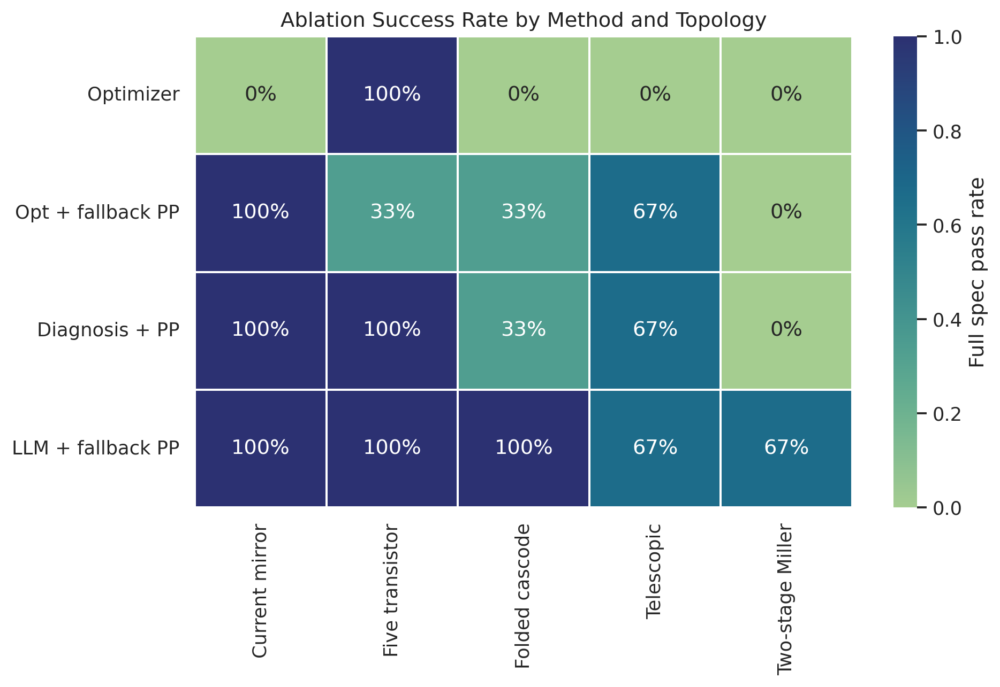
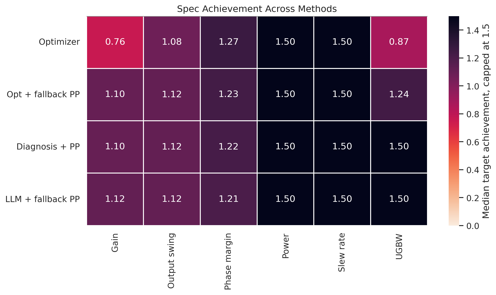
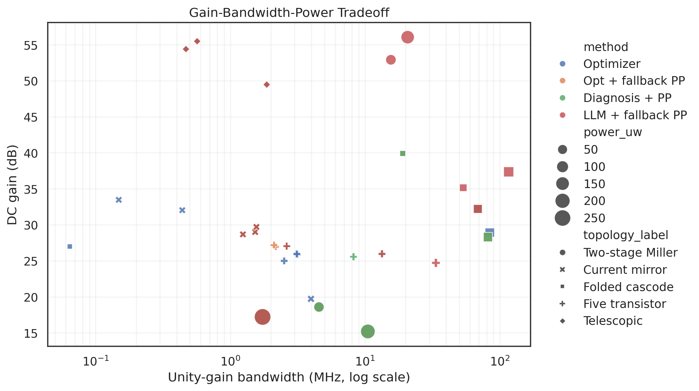
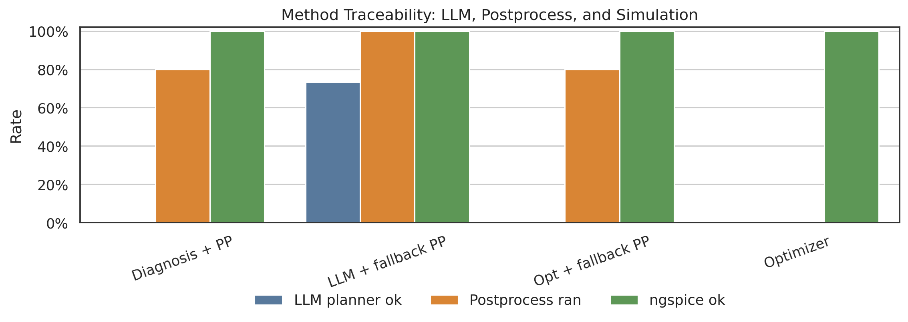
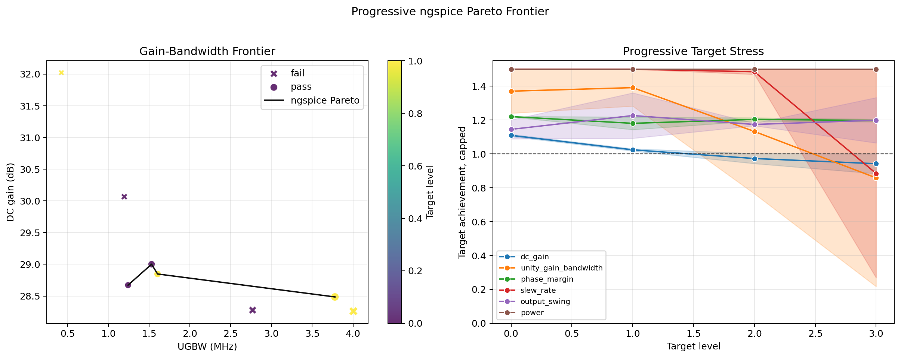

# AnalogRF-IR

AnalogRF-IR is a schema-driven analog and RF circuit optimization project for simulator-backed, agent-assisted circuit design. It turns circuit intent into a typed intermediate representation, runs gm/ID-aware optimization, validates candidates with ngspice, and records typed causal evidence so planner actions can be accepted or rejected by explicit optimizer-side math.

The current development focus is OTA-class analog design in IHP 130 nm, including current-mirror, telescopic, and folded-cascode OTAs, plus the earlier five-transistor and two-stage Miller examples. Comparator and broader RF support are present as extensible foundations, but are not yet signoff-grade flows.

> License notice: this repository is source-available only. All rights are reserved. See [LICENSE](https://github.com/Yixin-Gong/AnalogRF-IR/blob/main/LICENSE).

## Highlights

- YAML-first design state for topology, variables, targets, constraints, evaluations, and compact diagnostics.
- ASIR semantic extraction for roles, symmetry groups, gain stages, bias paths, and compensation networks.
- gm/ID-based compact sizing with NSGA-II exploration.
- Hard validation for schema write policy, symmetry consistency, operating-point safety, and layout-realizable W/L constraints.
- Layout realization for oversized devices through finger folding, parallel devices, and series length segmentation.
- ngspice-backed AC, DC, transient, operating-point, slew-rate, output-swing, headroom, and power measurements.
- Optional postprocess repair for OP validation, bias balancing, and compensation tuning.
- LangGraph-based multi-round agent loop for diagnosis-guided schema tuning.
- DeepSeek-compatible LLM planner with deterministic fallback behavior.
- Structure-aware causal diagnosis with typed causal edges, typed ASIR dependencies, local intervention modeling, and evidence-gated guarded actions.
- Ablation tooling for topology, method, seed, postprocess, LLM, and per-spec comparisons, including clean plotting outputs.
- Compact schema artifacts plus full JSON evidence artifacts for reproducibility and debugging.

## Repository Layout

```text
asir/          Semantic IR, profile selection, and extraction helpers
core/          Design rules, validation, regions, and process environment models
diagnostics/   Causal diagnostics, intervention models, and agent-safe tuning
feasibility/   Physics-informed feasibility estimation
flow/          End-to-end orchestration and LangGraph agent loop control
frontends/     YAML and SPICE input frontends
inputs/        Maintained circuit-family schema examples
layout/        Physical realization helpers for folding and segmentation
netlist/       Schema-to-SPICE generation
optimizer/     Compact evaluators and NSGA-II optimization
outputs/       Run artifact writers and compact schema views
postprocess/   Optional ngspice-guided repair and compensation tuning
schemas/       Typed design-state schema definitions
simulator/     ngspice execution and measurement extraction
specs/         Specification and metric utilities
tests/         Regression tests
docs/          Architecture, quickstart, schema, and development notes
```

## Requirements

- Ubuntu Linux or WSL Ubuntu
- Python 3.10 or newer
- `python3-venv`, `pip`, and `ngspice`
- Python packages in `requirements.txt`
- Process model files and lookup tables for the target technology

Install system dependencies:

```bash
sudo apt-get update
sudo apt-get install -y python3 python3-venv python3-pip ngspice
```

Create a local Python environment:

```bash
cd /path/to/AnalogRF-IR
python3 -m venv .venv
. .venv/bin/activate
python3 -m pip install --upgrade pip
python3 -m pip install -r requirements.txt
```

## Quick Start

Run a two-stage OTA optimization:

```bash
cd /path/to/AnalogRF-IR
. .venv/bin/activate

python main.py \
  --env environment_ihp_sg13g2.yaml \
  --schema inputs/ota/two_stage_miller/two_stage_miller_ota.yaml \
  --topology two_stage \
  --generations 4 \
  --pop-size 20 \
  --seed 17
```

Run a five-transistor OTA optimization:

```bash
python main.py \
  --env environment_ihp_sg13g2.yaml \
  --schema inputs/ota/five_transistor/five_transistor_ota.yaml \
  --topology five \
  --generations 4 \
  --pop-size 20 \
  --seed 17
```

Run an IHP 130 nm OTA topology:

```bash
python main.py \
  --env environment_ihp_sg13g2.yaml \
  --schema inputs/ota/folded_cascode/folded_cascode_ota_ihp130.yaml \
  --topology yaml \
  --generations 50 \
  --pop-size 100 \
  --seed 1
```

Run the regression suite:

```bash
. .venv/bin/activate
python -m pytest -q
```

## LLM-Guided Diagnosis

The multi-round agent flow uses LangGraph to separate simulation, diagnosis, schema-command generation, and command execution. The agent reads generated `design_state.yaml` artifacts as the compact source of truth and only applies edits through schema-level tool commands.

Set a DeepSeek API key before running LLM-guided rounds:

```bash
export DEEPSEEK_API_KEY="..."
```

Run a DeepSeek-guided two-stage OTA flow:

```bash
python main.py \
  --env environment_ihp_sg13g2.yaml \
  --schema inputs/ota/two_stage_miller/two_stage_miller_ota.yaml \
  --topology two_stage \
  --generations 4 \
  --pop-size 20 \
  --seed 17 \
  --agent-rounds 20 \
  --llm-provider deepseek \
  --llm-model deepseek-v4-pro \
  --llm-thinking enabled \
  --llm-reasoning-effort max \
  --llm-timeout 180 \
  --llm-max-tokens 12000 \
  --postprocess-policy fallback \
  --reopt-generations 3 \
  --reopt-pop-size 12 \
  --intervention-max-actions 3
```

CLI options can also be edited in YAML and then overridden from the command
line:

```bash
python main.py --config configs/default.yaml --generations 20 --agent-rounds 1
```

The current IHP 130 nm OTA ablation matrix is defined in
`configs/ablation_ihp130_ota.yaml`. It compares five canonical OTA examples:
five-transistor, current-mirror, telescopic-cascode, folded-cascode, and
two-stage Miller OTAs across optimizer-only, optimizer-plus-postprocess,
deterministic diagnosis, and full LLM diagnosis methods.

The default OTA schemas use calibrated IHP 130 nm regression targets for method
comparison under `simulation.cload = 1 pF`: 24.5 dB / 2.3 MHz for the 5T OTA,
26 dB / 1 MHz for the current-mirror OTA, 42 dB / 0.2 MHz for the telescopic
OTA, 32 dB / 50 MHz for the folded-cascode OTA, and 46 dB / 12 MHz for the
two-stage Miller OTA. These are high-impedance capacitive-load targets; they
are not low-resistance, pad, cable, or 50 ohm load targets.

```bash
python scripts/run_ablation.py --config configs/ablation_ihp130_ota.yaml
python scripts/run_ablation.py --config configs/ablation_ihp130_ota.yaml --case optimizer_only --seed 1 --limit 1 --run
python scripts/run_ablation.py \
  --config configs/ablation_ihp130_ota.yaml \
  --output-dir runs/ablations_ihp130_ota_calibrated_mim_cl1pf_maxiter20 \
  --llm-api-key-file ~/.config/analogrf-ir/deepseek.key \
  --run --keep-going
python scripts/plot_ablation_results.py \
  --manifest runs/ablations_ihp130_ota_calibrated_mim_cl1pf_maxiter20/manifest.json \
  --out-dir runs/ablations_ihp130_ota_calibrated_mim_cl1pf_maxiter20/figures
```

Latest IHP130 OTA evaluation snapshots:

These figures were regenerated from the 60-run IHP130 OTA matrix: five OTA
topologies, four method settings, three seeds, and up to 20 diagnosis rounds
per run. The ablation manifest records the best verified result for each job,
so a later exploratory diagnosis round cannot overwrite an earlier, better
validated candidate.











Progressive target tightening can be used after a baseline passes to map a
measured ngspice Pareto frontier. The script materializes one schema per ladder
level, reruns the normal flow, and keeps the non-dominated passing points:

```bash
python scripts/run_progressive_pareto.py \
  --schema inputs/ota/current_mirror/current_mirror_ota_ihp130.yaml \
  --seed 1 --seed 2 \
  --output-dir runs/progressive_pareto_current_mirror_mim_cl1pf \
  --levels 6 \
  --run
```

If the API key is not configured, the flow records an LLM fallback status and continues with deterministic schema commands so local tests and non-LLM experiments remain reproducible.

## Causal Action Planning

The diagnosis layer is a structure-aware causal diagnosis system, not a raw sensitivity ranking tool.

The default project strategy is budget-aware:

```text
global optimizer with small budget
  -> causal diagnosis + local intervention evidence
  -> constrained action optimizer / LLM planner
  -> short re-optimization
  -> postprocess only if stuck or near-feasible
```

Each agent round follows three decoupled decision steps:

1. **Causal graph diagnosis** ranks structural root-cause nodes using dependency paths, operating-point evidence, propagation effects, and weak sensitivity priors.
2. **Local intervention modeling** perturbs a small number of schema-safe actions in SPICE and builds a local action-to-violation model.
3. **Constrained action optimization** selects compatible action combinations by minimizing residual weighted violation plus penalties for uncertainty, duplicate writes, guarded actions, and cross-metric regressions.

Guarded actions are evidence-gated. A guarded action can be applied automatically only when the local SPICE intervention evidence predicts a sufficient decrease in the weighted normalized violation objective, reduces at least one failed metric, keeps tradeoffs bounded, and has acceptable uncertainty.

All LLM apply requests are executor-gated by the same optimizer math:

```text
apply_allowed := optimizer_selected OR objective_delta < 0
```

Custom LLM edits cannot bypass `no_improving_combination`; they are recorded as skipped notes unless they correspond to an admissible optimizer candidate. Candidate actions also carry typed classes such as `compensation`, `operating_point_balance`, and `operating_point_headroom`, keeping OP/balance moves inside the constrained action optimizer instead of relying on postprocess repair.

The evidence gate minimizes the weighted normalized violation objective:

$$
J(\mathbf{v}) = \sum_i w_i v_i^2,\qquad
\mathbf{v}'_j = [\mathbf{v} + \mathbf{A}_{:,j}]_+
$$

where `v` is the normalized specification violation vector, `A_{:,j}` is the local intervention column for action `j`, and `[\cdot]_+` projects elementwise to nonnegative residual violation.

The action strategy is coarse-to-fine. Large violations permit larger schema-safe coarse moves. Near-feasible states switch to smaller fine moves, and every proposed edit is checked by the hard physical gate before it can seed the next SPICE run.

Full causal artifacts use typed causal edges with node types, relation type, polarity, and mechanism. ASIR symbolic dependency graphs also type dependency rules and edges by relation type and input/output quantity type.

## Design State Contract

AnalogRF-IR treats generated schemas as a compact, user-readable decision interface. Heavy evidence is written to JSON artifacts instead of being embedded into the YAML state.

```text
design_state.yaml        Compact state, measurements, summary diagnostics, and schema actions
causal_diagnostics.json  Full causal graph, local intervention model, and evidence details
agent_diagnostics.json   Agent-facing diagnostic report
sim_log.json             Simulator and optimizer log view
result.json              Compact pass/fail and metric summary
```

The agent write policy is intentionally narrow:

- It may update existing design-variable initials and ranges.
- It may update existing per-device or global constraint ranges.
- It may update supported gm/ID and L strategies.
- It may not rewrite topology, targets, simulator outputs, process data, device connections, or transistor operating-point measurements.

This keeps user-authored inputs, generated diagnostics, optimization logic, and postprocess repair decoupled.

## Physical Safety

Before an action reaches SPICE, the flow applies hard checks for:

- explicit symmetry labels and matched-pair consistency,
- schema variable bounds and per-device constraints,
- operating-region and headroom rules,
- maximum W/L layout realizability,
- folding, parallelization, or series segmentation for oversized devices,
- write-policy compliance for all agent actions.

Invalid physical states are rejected in validation instead of being silently simulated.

## Postprocess Policy

Postprocess is an optional repair layer, not the core diagnosis method. It can improve robustness for near-feasible designs or stuck operating points, but it is kept separate from:

- global optimization,
- causal graph diagnosis,
- local intervention modeling,
- LLM planning,
- schema command execution.

For method comparisons, postprocess can be ablated against `optimizer + diagnosis` and `LLM + optimizer + diagnosis` flows to measure success rate, total SPICE calls, wall time, final loss, and metric quality.

CLI policy:

```text
--postprocess-policy fallback   run only when near-feasible or stagnated
--postprocess-policy always     legacy always-on repair behavior
--postprocess-policy off        disable postprocess for ablation
```

## Documentation

Additional project notes are maintained in [docs](https://github.com/Yixin-Gong/AnalogRF-IR/tree/main/docs):

- [Quick Start](https://github.com/Yixin-Gong/AnalogRF-IR/blob/main/docs/quickstart.md)
- [Architecture](https://github.com/Yixin-Gong/AnalogRF-IR/blob/main/docs/architecture.md)
- [Ablation Experiments](https://github.com/Yixin-Gong/AnalogRF-IR/blob/main/docs/ablation_experiments.md)
- [Schema Guide](https://github.com/Yixin-Gong/AnalogRF-IR/blob/main/docs/schema_guide.md)
- [Development Guide](https://github.com/Yixin-Gong/AnalogRF-IR/blob/main/docs/development.md)

The repository root `README.md` mirrors this document so GitHub displays the maintained project overview on the repository homepage.

## Development

Recommended workflow:

```bash
. .venv/bin/activate
python -m pytest -q
python -m compileall asir core diagnostics flow frontends layout netlist optimizer outputs postprocess schemas simulator specs tests
```

When adding a new circuit family:

1. Define or update the IR profile in `asir/profiles.py`.
2. Add schema examples with explicit device roles, symmetry labels, variables, targets, and evaluations.
3. Register profile-specific rules and validation behavior.
4. Add compact estimators only where the analytical model is defensible.
5. Add simulator measurements for final validation.
6. Add optional postprocess repair only when it is physically justified and ablatable.
7. Add regression tests for profile selection, constraints, diagnostics, artifacts, and physical validation.

## Current Limitations

- Compact models are optimization guidance, not signoff results.
- Output swing is extracted from OP/headroom limits; ICMR is intentionally outside the default OTA optimization and validation targets.
- Comparator delay, offset, kickback, noise, energy, and metastability require dedicated transient, noise, and Monte Carlo testbenches.
- RF-specific flows still need S-parameter, noise figure, compression, matching, linearity, and stability extensions.
- LLM-guided diagnosis is experimental and should be treated as a planner/explainer layer over simulator-backed evidence.

## Roadmap

- Expand constrained combo-action optimization with more topology-aware OP and balance moves.
- Expand the project evaluation matrix across topology, method, seed, spec target, and postprocess policy.
- More complete comparator and RF signoff testbenches.
- Tighter reproducibility metadata for process, simulator, model, and planner configuration.
- Additional physical-layout constraints beyond first-order W/L realization.

## License

This project is provided under a proprietary, all-rights-reserved license. No permission is granted to use, copy, modify, distribute, sublicense, publish, host, or create derivative works except by explicit written permission from the copyright holder.

See [LICENSE](https://github.com/Yixin-Gong/AnalogRF-IR/blob/main/LICENSE) for the complete terms.
