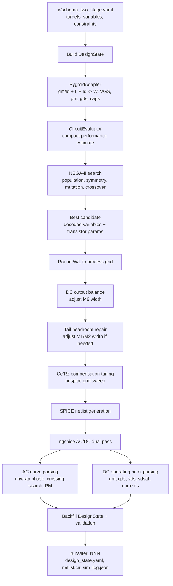

# Schema-Driven gm/ID Optimization and Verification Flow for a Two-Stage CMOS OTA

## Abstract

本文整理了当前 `objective_ir` 项目中两级 CMOS OTA 的自动优化、补偿调谐、ngspice 验证与 Pareto 前沿分析方法。系统以 schema 作为规格与约束入口，将 `gm/id`、沟道长度 `L`、偏置电流、Miller 补偿电容 `Cc` 和调零电阻 `Rz` 作为可优化变量；通过 gm/ID lookup table 将抽象设计变量转换为晶体管尺寸和小信号参数；再由 NSGA-II 搜索候选解，并使用 ngspice 进行最终物理验证。

本次重构重点解决了两级 OTA 优化中出现的 PM 虚高和不收敛问题。原流程直接使用 ngspice `.meas ac phase_margin find vp(vout) when vdb(vout)=0` 的主值相位，未处理相位环绕，导致曾出现 `PM=166 deg` 的假稳定结果。更新后的仿真器导出完整 AC Bode 曲线，在 Python 中进行相位 unwrap、0 dB 穿越点搜索和最差穿越点 PM 计算，从而避免相位 wrap 造成的误判。最终在 500 MHz UGBW 规格下得到一组通过后仿真的解：`dc_gain=68.84 dB`、`UGBW=532.43 MHz`、`PM=100.86 deg`、`power=251.68 uW`。

## Keywords

Two-stage OTA, gm/ID methodology, NSGA-II, Miller compensation, phase margin, ngspice, schema-driven optimization, Pareto front

## 1. Introduction

模拟电路自动化优化常遇到三个问题：

1. 规格、约束和优化变量散落在代码中，难以追踪。
2. 优化器的紧凑模型与 SPICE 后仿真不一致，导致看似收敛但仿真失败。
3. 稳定性指标，尤其是 phase margin，对测量方式高度敏感，容易被相位主值和多穿越点误导。

本项目采用 schema-driven flow，把目标规格、变量范围、软约束和评估声明写入 `ir/schema_two_stage.yaml`。优化器只负责在 schema 给定的空间中搜索；ngspice 是最终性能裁判；DesignState 则作为数据流中的唯一状态载体。

当前工作对象是 PTM 130 nm 工艺下的 Miller-compensated two-stage OTA。最新规格为：

| Metric | Target |
|---|---:|
| DC gain | >= 60 dB |
| Unity-gain bandwidth | >= 500 MHz |
| Phase margin | >= 60 deg |
| Power | <= 500 uW |
| CMRR | >= 30 dB |
| PSRR+ | >= 20 dB |

## 2. Circuit Topology and Design Variables

### 2.1 Two-Stage OTA Topology

电路由七个 MOS 管组成：

| Device | Type | Role | Main connection |
|---|---|---|---|
| M1, M2 | NMOS | Differential input pair | drains at `net1`, `n1`; common source `tail` |
| M3, M4 | PMOS | Current mirror load | first-stage active load |
| M5 | NMOS | Tail current source | input-stage bias current |
| M6 | PMOS | Second-stage gain device | gate driven by `n1`, drain at `vout` |
| M7 | NMOS | Output current source | second-stage sink current |
| Rz, Cc | passive | Miller compensation | series R-C from `n1` to `vout` |

The compensation network is:

```spice
Rz n1 ncc <Rz>
Cc ncc vout <Cc>
```

### 2.2 Optimization Variables

Schema 中的优化变量包括：

| Variable group | Variables |
|---|---|
| M1/M2 | `gm_id`, `L`, with symmetry label `sym_M1_M2` |
| M3/M4 | `gm_id`, `L`, with symmetry label `sym_load_M3_M4` |
| M5 | `gm_id`, `L` |
| M6 | `gm_id`, `L` |
| M7 | `gm_id`, `L` |
| Global | `I_tail`, `I_stage2`, `Cc`, `Rz` |

其中 `gm_id` 与 `L` 决定 lookup table 查询点，电流变量决定每个器件的目标偏置电流，`Cc/Rz` 决定补偿零点与环路稳定性。

## 3. Schema-Driven Problem Formulation

### 3.1 Target Specification

当前 two-stage schema 的核心规格为：

```yaml
targets:
  dc_gain:              {min: 60, unit: dB, priority: 1}
  unity_gain_bandwidth: {min: 500000000, unit: Hz, priority: 1}
  phase_margin:         {min: 60, unit: deg, priority: 1}
  power:                {max: 5.0e-04, unit: W, priority: 2}
```

这些 target 一方面进入 loss function，另一方面用于最终验收。ngspice 后仿真指标必须满足 target 才能认为设计通过。

### 3.2 Search-Space Constraints

变量范围同样由 schema 给出。例如：

```yaml
M1.gm_id: 10 to 22
M1.L:     0.3 um to 2.0 um
M6.gm_id: 6 to 18
M6.L:     0.2 um to 2.0 um
I_tail:   5 uA to 80 uA
I_stage2: 10 uA to 250 uA
Cc:       100 fF to 2.5 pF
Rz:       100 ohm to 20 kohm
```

约束分为三类：

1. Hard range constraints: 变量必须落在 schema 范围内。
2. Symmetry constraints: M1/M2、M3/M4 的 `gm_id` 和 `L` 锁定一致。
3. Physical constraints: 由 validator 检查，例如饱和区、VDSAT 裕量、宽长规则、电压堆叠等。

### 3.3 Loss Function

优化器中的标量 loss 由 schema 的 `loss_terms` 定义：

```text
gain_deficit = relu(gain_min - gain) / gain_min
bw_deficit   = relu(ugbw_min - ugbw) / ugbw_min
pm_deficit   = relu(pm_min - pm) / pm_min
power_ratio  = power / power_max
zero_alignment = abs(Rz - zero_target_rz) / zero_target_rz
```

加权总损失为：

```text
L_total =
  4.0 * gain_deficit
+ 3.0 * bw_deficit
+ 7.0 * pm_deficit
+ 0.4 * power_ratio
+ 0.08 * zero_alignment
```

这里 PM 权重较高，因为两级 OTA 的可用性首先受稳定性限制。`zero_alignment` 是软指导项，用于鼓励 `Rz` 靠近紧凑模型估算的零点位置；最终仍以 ngspice 曲线为准。

## 4. End-to-End Data Flow

整体数据流如下：



### 4.1 State Ownership

| Layer | Owner | Content |
|---|---|---|
| L1 | user/spec | topology and target specs |
| L2 | user/agent | design variables, constraints, loss terms |
| L3 | user/agent | evaluation declarations |
| L4 | scripts only | transistor physical parameters and simulation backfill |

This division avoids accidental overwrites: optimization may update physical state, but it should not silently change user-level topology or target specs.

## 5. gm/ID Translation Model

The compact evaluator uses gm/ID lookup tables to translate abstract design variables into transistor parameters.

For each device:

```text
input:  gm_id_target, L, Id, device_type
output: W, VGS, gm, gds, cgs, cgd, cgg, vdsat, ft
```

### 5.1 Current Assignment

The current model is role-based:

| Role | Current |
|---|---|
| input_pair | `I_tail / 2` |
| current_mirror_load | `I_tail / 2` |
| tail_current_source | `I_tail` |
| second_stage_gain | `I_stage2` |
| output_current_source | `I_stage2` |

### 5.2 Special Handling of M6

M6 is a PMOS common-source second-stage device. Its gate is not independently biased; it is driven by the first-stage output node `n1`. Therefore, the sizing of M6 cannot simply use an arbitrary target `gm_id` bias point. The updated flow sizes M6 using `forward_vgs()` when the first-stage PMOS load VGS is available, so that M6 is evaluated at the gate voltage imposed by the first-stage output.

This change improves the consistency between compact estimation and ngspice backfill.

## 6. Optimization Algorithm

### 6.1 NSGA-II Structure

The optimizer uses a NSGA-II style evolutionary loop:

1. Initialize population from schema initial values and randomized samples.
2. Enforce symmetry constraints.
3. Decode each individual into device/global variables.
4. Translate variables into physical transistor parameters.
5. Estimate performance and calculate objectives/loss.
6. Sort by non-domination and crowding distance.
7. Generate offspring by tournament selection, SBX crossover, and polynomial mutation.
8. Repeat until generations are exhausted or convergence criterion is met.

### Algorithm 1: Main Scalar-Loss Optimization

```text
Input:
  schema S, lookup tables L, optimizer config C

Build DesignState from S
Build CircuitEvaluator using L
Initialize population P
Apply symmetry constraints to P
Evaluate compact model for every individual

for generation = 1 to C.n_generations:
    Generate offspring Q from P
    Apply symmetry constraints to Q
    Evaluate compact model for every q in Q
    R = P union Q
    fronts = non_dominated_sort(R)
    assign_crowding_distance(fronts)
    P = select_next_generation(R, fronts)
    update global best by scalar total_loss

Return best decoded variables and physical parameters
```

### 6.2 Current Limitation of the Main Optimizer

The main production flow still selects one scalar-loss winner. It uses NSGA-II machinery but the current `CircuitEvaluator.evaluate()` returns a scalar objective array containing `total_loss`. Therefore, the main run is best understood as scalar evolutionary optimization with NSGA-II selection infrastructure.

For explicit Pareto analysis, a separate multi-objective wrapper was added:

```text
objectives = [
  spec_deficit,
  power / power_max,
  -gain / gain_min,
  -ugbw / ugbw_min,
  -pm / pm_min
]
```

The script is:

```text
scripts/run_spec_pareto.py
```

However, because the compact PM model is still approximate, full-design-variable Pareto points should be treated as exploration candidates and checked by ngspice.

## 7. Post-Optimization Physical Repair

After the compact optimizer selects a candidate, several deterministic post-processing steps are applied before final verification.

### 7.1 Grid Rounding

The transistor dimensions are snapped to process precision:

```text
W -> W_precision grid
L -> L_precision grid
```

This avoids generating dimensions that cannot be represented by the target process grid.

### 7.2 Stage-2 DC Balance

The second-stage output must sit near mid-supply before AC stability measurements are meaningful. The flow adjusts M6 width by bisection-like scaling and evaluates ngspice DC operating point until:

```text
vout ~= VDD / 2
```

This step mainly prevents the second stage from being biased near a rail.

### 7.3 Tail Headroom Repair

When M5 has insufficient saturation margin, the flow scales M1/M2 input-pair widths upward. This reduces input pair VGS at the same current, raises the tail node headroom, and improves:

```text
M5 margin = VDS_M5 - VDSAT_M5
```

For the 500 MHz solution, M5 final margin is approximately:

```text
VDS - VDSAT ~= 54 mV
```

which passes the configured saturation margin rule.

## 8. Compensation Tuning

### 8.1 Motivation

Two-stage OTA convergence was mainly limited by compensation. The compact optimizer can estimate a reasonable region, but final PM and UGBW depend strongly on `Cc/Rz`. Therefore, a final ngspice-based compensation sweep is performed.

### 8.2 Candidate Grid

The tuning routine now explicitly samples:

```text
Cc: 100 fF, 125 fF, 150 fF, 200 fF, 250 fF,
    300 fF, 400 fF, 500 fF, 750 fF, 1 pF,
    current-scaled candidates, upper bound

Rz: 100 ohm, 300 ohm, 500 ohm, 750 ohm, 1 kohm,
    1.5 kohm, 2 kohm, 2.5 kohm, 3 kohm, 3.5 kohm,
    4 kohm, 4.5 kohm, 5 kohm, 7.5 kohm, 10 kohm,
    15 kohm, current/gm-derived candidates, upper bound
```

This was necessary because the 500 MHz design has a strong optimum near:

```text
Rz ~= 3.5 kohm to 4.5 kohm
```

Earlier sparse sampling missed this region and selected lower-PM points.

### Algorithm 2: Cc/Rz ngspice Tuning

```text
Input:
  DesignState after sizing and repair
  Cc range, Rz range, target specs

best_score = infinity
for Cc in Cc_candidates:
    for Rz in Rz_candidates:
        update state.global_parameters
        generate netlist
        run ngspice AC/DC
        parse gain, UGBW, PM, power
        score =
            gain shortfall penalty
          + bandwidth shortfall penalty
          + PM shortfall penalty
          + power penalty
          - small reward for PM margin
        if score < best_score:
            store Cc/Rz

Return best Cc/Rz and measurements
```

## 9. Phase Margin Measurement

### 9.1 Theory

For loop gain `T(jw)`, phase margin is defined at unity loop gain:

```text
|T(jw_gc)| = 1
PM = 180 deg + angle(T(jw_gc))
```

If the loop phase is `-120 deg` at unity gain, then:

```text
PM = 180 - 120 = 60 deg
```

PM is not mathematically limited to 90 deg. A first-order-like system may show PM greater than 90 deg, approaching 180 deg. However, a very high reported PM in a two-stage OTA should be checked carefully because it may come from phase wrapping, wrong loop breaking, or measuring output transfer phase instead of true loop gain.

### 9.2 Original Bug

The old flow used:

```spice
.meas ac phase_margin find vp(vout) when vdb(vout)=0
```

This reads ngspice's principal phase value at the 0 dB crossing. Principal phase is wrapped into a limited interval, so a true phase near `-193.6 deg` may be printed as approximately `+166.4 deg`. Treating that value as PM caused a false stable result.

Example from the previous failing point:

```text
ngspice principal phase: +166.4 deg
unwrapped phase:        -193.6 deg
computed PM:             -13.6 deg
```

This explains why the optimizer believed the design was stable while the two-stage OTA was actually unstable.

### 9.3 Updated AC Curve Method

The simulator now exports the full AC sweep:

```spice
.control
  set filetype=ascii
  set wr_singlescale
  set wr_vecnames
  run
  wrdata ac_sweep.dat vdb(vout) vp(vout)
.endc
```

Then Python performs:

1. Parse frequency, gain, and phase columns.
2. Convert phase units if needed.
3. Unwrap phase continuously.
4. Find all 0 dB crossings by log-frequency interpolation.
5. Compute PM at each crossing.
6. Use the worst PM if multiple crossings exist.

### Algorithm 3: Robust PM from Bode Curve

```text
Input:
  arrays f, gain_db, phase

phase_unwrapped = unwrap(phase)
crossings = []

for each adjacent pair i-1, i:
    if gain crosses 0 dB:
        interpolate log-frequency crossing f_gc
        interpolate phase at f_gc
        append crossing

for each crossing:
    relative_phase = phase_at_crossing - low_frequency_phase
    while relative_phase > 0:
        relative_phase -= 360 deg
    PM = 180 deg + relative_phase

return minimum PM over all crossings
```

### 9.4 Important Limitation

The current PM is an open-loop differential AC proxy based on `vout`; it is much more robust than the old `.meas` phase but is still not a full Middlebrook/Tian loop-gain measurement. For final silicon signoff, the next recommended improvement is a proper loop-gain testbench with loop breaking and injection source.

## 10. Pareto Analysis

Two types of Pareto analysis were added.

### 10.1 Full Design-Variable Estimated Pareto

Script:

```text
scripts/run_spec_pareto.py
```

Outputs:

```text
runs/pareto_001/population_estimated.csv
runs/pareto_001/pareto_estimated.csv
runs/pareto_001/ngspice_checked.csv
runs/pareto_001/ngspice_pareto.csv
```

This explores the full variable space but relies on compact PM estimates, so it is useful for trend finding, not final signoff.

### 10.2 ngspice Cc/Rz Compensation Pareto

Script:

```text
scripts/run_compensation_pareto.py
```

This takes a fixed, already-good transistor sizing from `runs/iter_024/netlist.cir`, sweeps `Cc/Rz`, and evaluates each point in ngspice. This gives a reliable local Pareto front for stability-bandwidth tradeoff.

Outputs:

```text
runs/pareto_comp_001/sweep.csv
runs/pareto_comp_001/pareto.csv
runs/pareto_comp_001/pareto_front.svg
runs/pareto_comp_001/summary.json
```

Measured sweep statistics:

| Item | Value |
|---|---:|
| Total Cc/Rz sweep points | 252 |
| Pareto points | 43 |
| Points passing 500 MHz spec | 32 |

Representative feasible Pareto points:

| Cc | Rz | UGBW | PM | Gain | Power |
|---:|---:|---:|---:|---:|---:|
| 2.50 pF | 3.5 kohm | 530.1 MHz | 112.8 deg | 68.8 dB | 251.7 uW |
| 0.50 pF | 3.5 kohm | 532.4 MHz | 100.9 deg | 68.8 dB | 251.7 uW |
| 0.30 pF | 3.5 kohm | 557.2 MHz | 89.9 deg | 68.8 dB | 251.7 uW |
| 2.50 pF | 4.0 kohm | 756.6 MHz | 86.0 deg | 68.8 dB | 251.7 uW |
| 2.50 pF | 4.5 kohm | 889.6 MHz | 68.8 deg | 68.8 dB | 251.7 uW |

The result shows that `Rz` is the dominant compensation knob in this design. The useful range is approximately:

```text
Rz ~= 3.5 kohm to 4.5 kohm
```

## 11. Experimental Setup

| Item | Value |
|---|---|
| OS/runtime | WSL Ubuntu-26.04 |
| Simulator | ngspice 45.2 |
| Python packages | numpy, yaml, project modules |
| Process model | PTM 130 nm |
| Supply | 1.2 V |
| Load capacitance | 200 fF |
| Main schema | `ir/schema_two_stage.yaml` |

Main command for the 500 MHz run:

```bash
python3 main.py --schema ir/schema_two_stage.yaml --generations 60 --pop-size 120 --seed 23
```

Pareto commands:

```bash
python3 scripts/run_spec_pareto.py \
  --schema ir/schema_two_stage.yaml \
  --pop-size 180 \
  --generations 80 \
  --seed 31 \
  --verify 16

python3 scripts/run_compensation_pareto.py \
  --netlist runs/iter_024/netlist.cir \
  --out runs/pareto_comp_001
```

## 12. Final 500 MHz Design Result

The final design output is:

```text
runs/iter_024/
```

Key ngspice measurements:

| Metric | Value |
|---|---:|
| DC gain | 68.84 dB |
| Unity-gain bandwidth | 532.43 MHz |
| Phase margin | 100.86 deg |
| Power | 251.68 uW |
| Unity-gain crossings | 1 |
| Phase lag at unity | 79.14 deg |

Final compensation:

| Component | Value |
|---|---:|
| Cc | 500 fF |
| Rz | 3.5 kohm |

Final device sizing from `netlist.cir`:

| Device | W | L |
|---|---:|---:|
| M1 | 3.59 um | 300 nm |
| M2 | 3.59 um | 300 nm |
| M3 | 2.64 um | 300 nm |
| M4 | 2.64 um | 300 nm |
| M5 | 2.76 um | 200 nm |
| M6 | 7.58 um | 226 nm |
| M7 | 4.21 um | 758 nm |

Operating region checks:

| Device | VDS | VDSAT | Margin |
|---|---:|---:|---:|
| M1/M2 | 0.472 V | 0.088 V | 0.384 V |
| M5 | 0.151 V | 0.098 V | 0.054 V |
| M6 | 0.591 V | 0.258 V | 0.333 V |
| M7 | 0.609 V | 0.247 V | 0.362 V |

Validator result:

```text
PASSED: 0 errors, 3 warnings
```

Remaining warnings are conservative voltage-stack warnings, M5 inversion-region preference, and power-density warning. They do not block the current spec pass but should be revisited for layout/reliability work.

## 13. Discussion

### 13.1 Why 2-Stage OTA Initially Did Not Converge

The main cause was not that the optimizer could not find a compensated solution. The root problem was the PM measurement path:

1. ngspice `.meas` returned principal phase, not phase margin.
2. The principal phase was not unwrapped.
3. The optimizer interpreted a wrapped phase near `+166 deg` as excellent PM.
4. Compensation tuning preferred very small `Cc` and high UGBW, which produced unstable or low-margin points.

After robust Bode parsing and denser `Cc/Rz` tuning, 500 MHz with PM above 60 deg became reachable.

### 13.2 Data Flow Consistency

The updated flow keeps variable ownership clear:

| Data | Source | Consumer |
|---|---|---|
| targets | schema | loss, validation, final pass/fail |
| design variable ranges | schema | optimizer bounds |
| gm/id, L | optimizer | gm/ID lookup |
| W, gm, gds, caps | lookup/evaluator | netlist/state/log |
| Cc, Rz | optimizer and tuner | netlist generator |
| AC curve | ngspice | PM/UGBW parser |
| operating point | ngspice DC pass | DesignState backfill and validator |

This makes it easier to debug mismatches: if optimizer estimate differs from ngspice, the difference is visible in `sim_log.json`.

### 13.3 Main Tradeoffs

For this two-stage OTA:

1. Smaller or poorly placed compensation can increase UGBW but may destroy PM.
2. `Rz` around 3.5 kohm to 4.5 kohm creates the most useful bandwidth-PM tradeoff.
3. `Cc=500 fF, Rz=3.5 kohm` is a balanced point.
4. `Cc=2.5 pF, Rz=4.5 kohm` gives much higher UGBW but lower PM, still above 60 deg.
5. M5 headroom is sensitive to input-pair VGS; widening M1/M2 helps saturation margin.

## 14. Limitations and Future Work

1. PM should be upgraded to true loop-gain measurement. The current method is a robust open-loop transfer proxy, not full Middlebrook/Tian loop gain.
2. The compact model still underestimates or mispredicts some ngspice behaviors, especially high-speed PM. More ngspice-in-the-loop search or surrogate correction would improve convergence.
3. Pareto search should eventually use real multi-objective SPICE-aware objectives rather than compact estimates alone.
4. Layout effects, parasitic loading, mismatch, noise, slew rate, input/output swing, and PVT corners are not yet included.
5. The remaining M5 inversion-region warning suggests that tail current source sizing could be improved if stronger inversion is required by design policy.

## 15. Conclusion

The updated flow successfully converts a schema-level two-stage OTA specification into a SPICE-verified design. The key methodological improvements are:

1. Treat schema as the source of truth for targets, variables, and constraints.
2. Use gm/ID lookup to bridge abstract optimization variables and transistor sizing.
3. Use ngspice dual-pass simulation for AC performance and DC operating points.
4. Replace fragile `.meas` phase-margin extraction with full Bode curve parsing and phase unwrap.
5. Add deterministic post-processing for DC output balance, tail headroom, and compensation tuning.
6. Generate local ngspice Pareto fronts to understand stability-bandwidth tradeoffs.

The final 500 MHz design meets the specified gain, UGBW, PM, and power targets with comfortable stability margin, and the generated reports/logs provide a reproducible path for future users to inspect, modify, and extend the flow.

