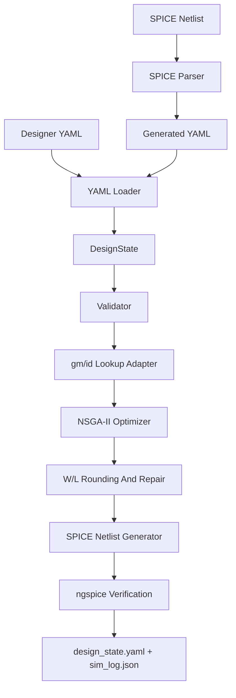

# YAML/SPICE Frontend Method Report

## Abstract

This update merges the ASIR prototype from `obj_irv2.0` into `objective_ir` and refactors the input side of the optimizer around a designer-editable YAML rule set. The optimizer, gm/id sizing model, compensation repair, and ngspice verification flow are retained. The new frontend supports two equivalent entry paths:

1. Designer edits YAML directly.
2. Designer provides a SPICE netlist; the parser generates YAML, seeds initial values, then the optimizer runs on the generated design state.

The goal is to make topology, specifications, constraints, design variables, loss terms, and initialization data explicit in YAML while keeping process and simulator settings in `environment.yaml`.

## Method

### Layered Representation

The project now has two complementary IR layers:

- `DesignState`: the optimization IR used by sizing, validation, netlist generation, and simulation.
- `ASIR`: the semantic IR imported from `obj_irv2.0`, currently focused on comparator topology semantics and layered graph extraction.

The optimizer consumes `DesignState`. ASIR can compile YAML topology into semantic graphs for reasoning, documentation, and future topology-aware diagnosis.

### YAML Rule Set

The YAML frontend accepts a top-level `topology` mapping with explicit devices and ports. It also reads:

- `targets`: spec-derived performance requirements.
- `constraints`: global and per-device bounds for `gm_id`, `L`, operating region, and other variables.
- `design_variables`: optimizer variables, including device variables and globals such as `I_tail`, `I_stage2`, `Cc`, and `Rz`.
- `loss_terms`: weighted formulas evaluated against `realized.*` and `targets.*`.
- `evaluations`: declared measurements such as gain, UGBW, phase margin, and power.
- `transistors`: optional physical seed values from a prior run or imported netlist.

If `loss_terms` are omitted, the YAML loader generates default target-tracking losses from `targets`. This keeps the objective function anchored to the spec rather than hidden in Python.

### SPICE Parsing

The parser supports simple MOS/resistor/capacitor netlists:

- MOS cards: `M... D G S B MODEL W=... L=...`
- Subckt MOS cards: `X... D G S B MODEL W=... L=...`
- Compensation passives: `Rz`, `Cc`
- Load capacitors and voltage sources for port inference

Generated instance names are canonicalized. For example, an optimizer-generated SPICE instance `MM1` maps back to YAML device id `M1`, preventing repeated parse/generate cycles from producing names such as `MMM1`.

### Diagnosis And Initialization

After YAML loading, the frontend diagnoses missing initial values:

- Missing `gm_id` seeds are assigned from device roles.
- Missing `L` seeds are assigned from role defaults.
- Missing global variable seeds use range midpoints.
- Seed values are clipped into YAML constraints.
- Symmetry labels are preserved or generated by the existing `DesignState.build_design_variables()` method.

The resulting initial point is therefore always represented in the same variable space used by NSGA-II.

## Algorithm Flow



## Commands

Run from hand-edited YAML:

```bash
python3 main.py --schema ir/schema_two_stage.yaml --topology yaml --generations 60 --pop-size 120 --seed 23
```

Convert SPICE to YAML:

```bash
python3 scripts/spice_to_yaml.py runs/iter_024/netlist.cir --out runs/tmp_spice_import/imported.yaml --name imported_two_stage
```

Run the one-command SPICE frontend:

```bash
python3 main.py --spice runs/iter_024/netlist.cir --spice-yaml-out runs/tmp_spice_import/imported.yaml --generations 60 --pop-size 120 --seed 23
```

Compile ASIR semantics from YAML:

```bash
python3 -m asir from-yaml inputs/strongarm_v1.yaml --out runs/tmp_asir_smoke/strongarm_asir.yaml --summary
```

## Verification

Current smoke tests cover:

- ASIR comparator examples and YAML compilation.
- SPICE parser canonicalization from `MM1` to `M1`.
- SPICE-generated YAML construction into optimizer `DesignState`.
- Windows Python and Ubuntu-26.04 WSL execution.

Validation command:

```bash
python3 -m pytest tests/test_frontends.py tests/test_asir.py -q
```

## Limitations

The SPICE parser is intentionally conservative. It handles common flat OTA netlists but does not yet parse arbitrary `.subckt` hierarchies, expressions, parameters, or PDK-specific passive models. Imported roles should be reviewed in YAML before long optimization runs.

The optimizer remains OTA-oriented. ASIR comparator semantics are available for topology reasoning, but comparator sizing objectives are not yet connected to the NSGA-II analog sizing loop.
